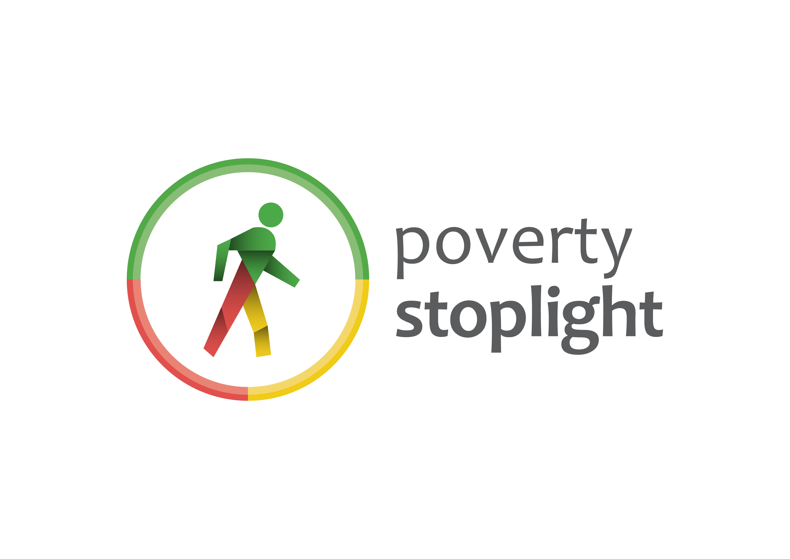

# [Poverty Stoplight](https://www.povertystoplight.org/) &middot; 

> Eliminate multidimensional poverty.

The Poverty Stoplight survey was created as both a metric and a methodology to enable families to assess their levels of multidimensional poverty.

Using an app on a phone, tablet or computer, families take a visual survey to self-evaluate their level of poverty, visualize their results on a dashboard, and create a lifemap that helps them target their situation to overcome poverty. Families select images, categorized as red, yellow or green, that resemble their reality for each poverty indicator. Through its geo-tagging capabilities, the app then identifies the family’s location for entire communities, allowing stakeholders to make targeted efforts and to better channel resources in a joint effort to eliminate poverty.

## Run this project

This project was bootstrapped with [Create React App](https://github.com/facebook/create-react-app).

Install all the dependencies with `yarn`.

### Available Scripts

In the project directory, you can run:

#### `yarn start`

Runs the app in the development mode. 
Open [http://localhost:3000](http://localhost:3000) to view it in the browser.

The page will reload if you make edits. 
You will also see any lint errors in the console.

----

Hosting sponsored by <a href="https://netlify.com">Netlify</a> 
